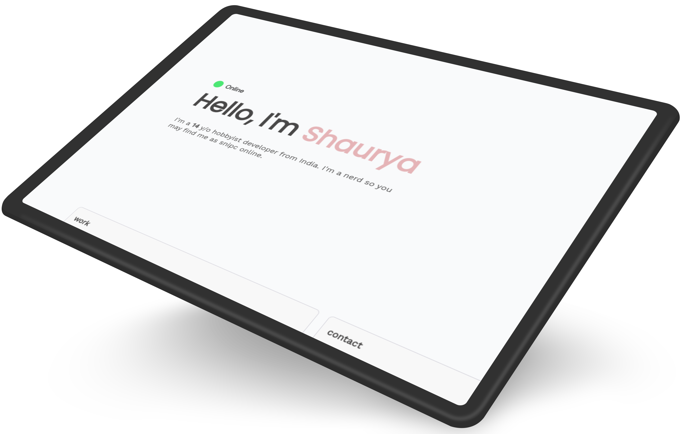

## Stack
- React.js (with react-router)
- Vite
- Iconify
- Support 🤝

## Get for yourself

All components and pages are in `src/pages` and `src/components` respectively. Edit as per your needs.

All routes and default components are in `src/App.js`.

Refer to [this official deployment guide of Vite](https://vitejs.dev/guide/static-deploy).

## Credits & Inspirations ✨

Thanks a lot to [Eggsy](https://eggsy.xyz) (really lot! ) & Neksio to provide overall inspiration for this project ☁️.

[Lanyard](https://github.com/Phineas/Lanyard) for a sweet and hassle free Discord status integration 🛠️.

And, to all awesome people out there who contributed in any way!    

